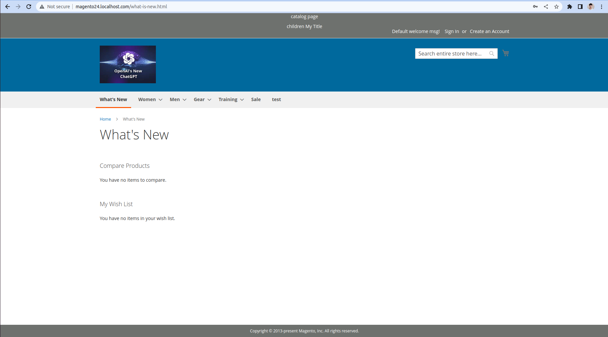
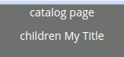
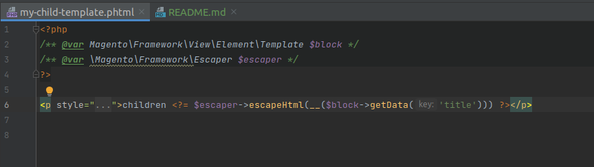
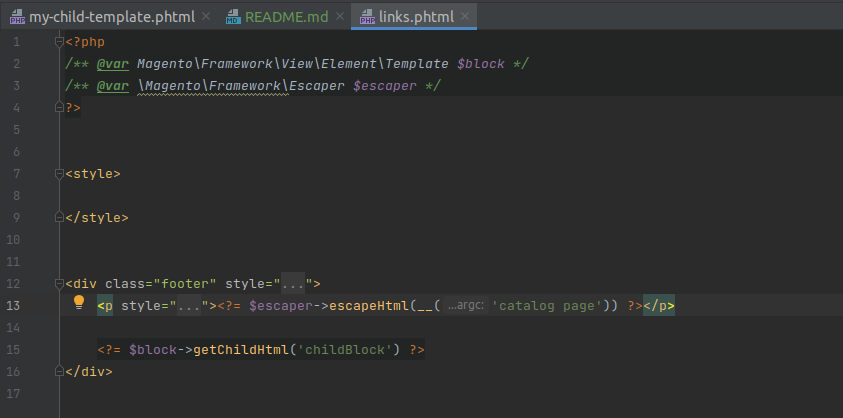
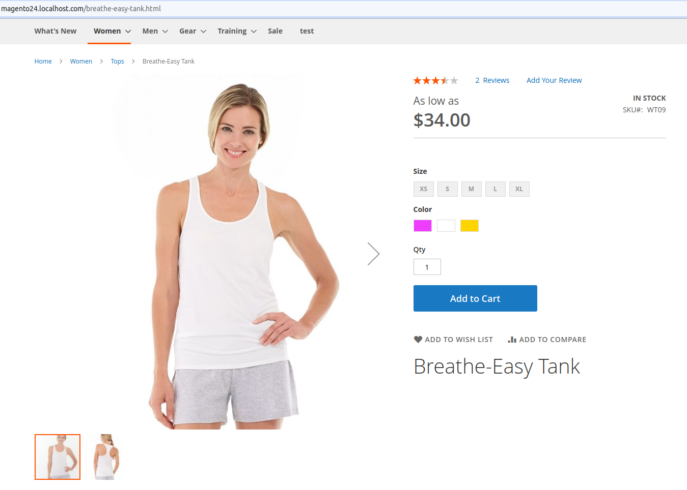
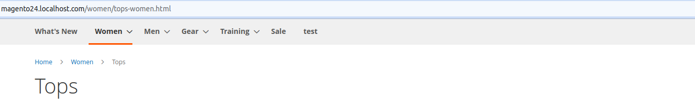

## Code challenge 1.

### Add a container to the footer on all pages

### Add a block to the container that outputs a message

### Move the message on category pages to the header

## Code challenge 2.

### Add a child block to one of your previously created blocks and output further content from another template

### Use arguments to pass and output data to the new child block

### Escape the output in your templates

## Code challenge 3.

### Override a layout file:

#### From a theme

#### I moved name down

#### From a module

#### I deleted header container

